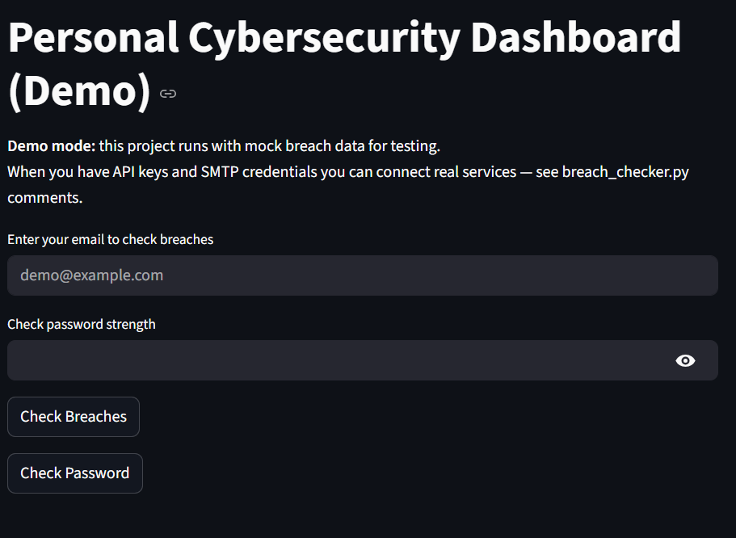
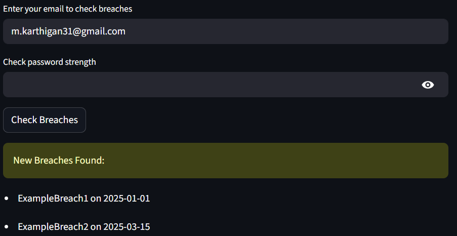
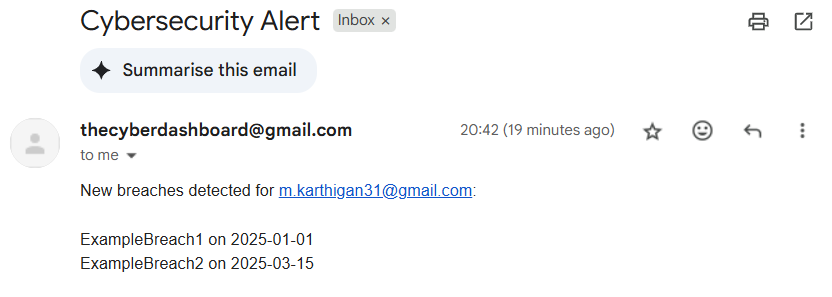
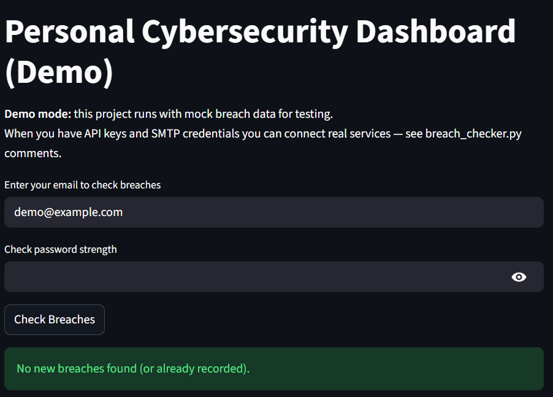
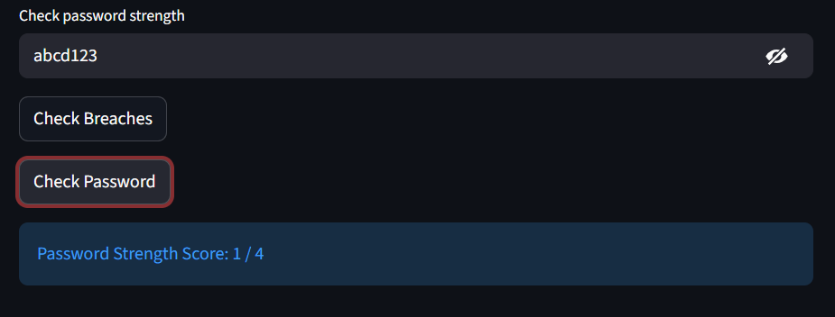
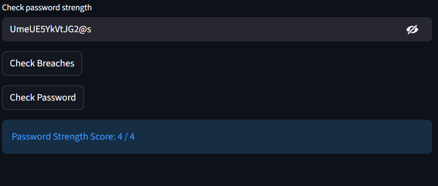

# Personal Cybersecurity Dashboard (Demo)

## Overview
The **Personal Cybersecurity Dashboard** is a Python project designed to help users monitor potential email breaches and assess password strength. This project currently runs in **demo mode**, using mock breach data, allowing testing without API keys.  

The system is built with **Streamlit** for the user interface, **SQLite** for storing historical breaches, and includes optional **password strength checking** via `zxcvbn-python`. It is prepared to integrate real APIs (HaveIBeenPwned, EmailRep) and real email alerts once credentials are available.

---

## Features
- Check email addresses for historical or new breaches (mock data for demo).
- Store breaches in a local SQLite database to avoid duplicate alerts.
- Simulated email alerts (prints messages to console) or real SMTP emails if configured.
- Password strength checking using `zxcvbn-python`.
- Scheduler to run automated daily checks.
- Ready for integration with real API services and email notifications.

---

## Getting Started

### Prerequisites
- Python 3.9+
- `pip` package manager
- `zxcvbn-python` for password strength checking

### Installation
1. Download or clone the repository.
2. Install required packages:
    ```bash
    pip install streamlit schedule
    pip install zxcvbn-python 
    ```

### Run the Dashboard
```bash
streamlit run main.py
```

## Screenshots

### Dashboard UI

*Main Streamlit interface. Enter email to check for breaches or a password to check strength.*

### Demo Breach Result


*Detected breach for `m.karthigan31@gmail.com` using the mock dataset. The app records breaches to SQLite and triggers an alert (simulated email in demo mode).*

### No Breach Result

*Example of a clean check — no new breaches found for this email.*

### Password Strength — Low

*Password strength check showing a low score (0–1). Use to encourage better passwords.*

### Password Strength — High

*Password strength check showing a high score (3–4).*


